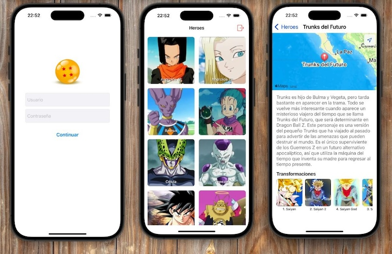
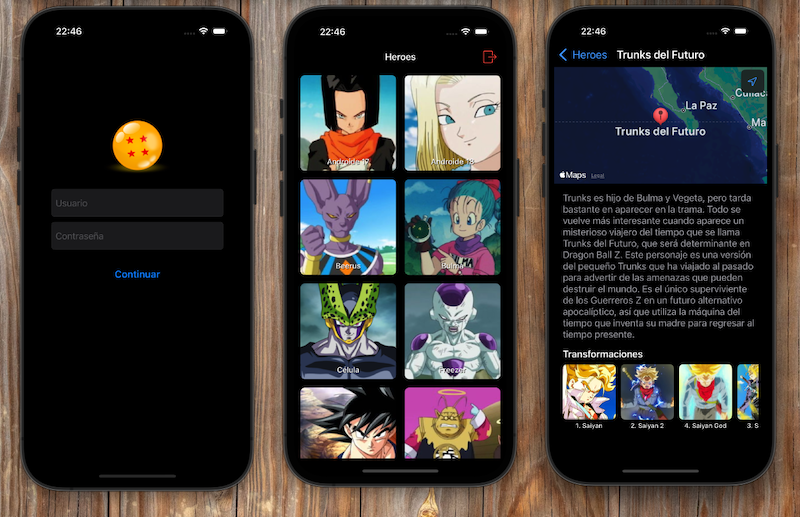

# GokuAndFriends - Dragon Ball Heroes App

## 🏷️ Descripción

GokuAndFriends es una aplicación iOS que permite a los fans explorar los personajes del universo Dragon Ball, visualizar sus ubicaciones en el mapa y descubrir sus distintas transformaciones. La aplicación implementa una arquitectura MVVM robusta, consume una API REST con autenticación mediante tokens y utiliza Core Data para persistencia local.

## 📱 Capturas de Pantalla

## ✨ Características Principales

* **Autenticación segura** - Sistema de login con almacenamiento de token en Keychain
* **Catálogo de héroes** - Visualización en grid de personajes con imágenes y nombres
* **Ficha detallada** - Información completa de cada personaje
* **Geolocalización** - Visualización de ubicaciones en mapas interactivos
* **Transformaciones** - Galería de las distintas formas que puede adoptar cada personaje
* **Modo offline** - Visualización de datos previamente cargados sin conexión a internet

## 🏗️ Arquitectura

El proyecto implementa una arquitectura **MVVM** (Model-View-ViewModel) con las siguientes capas:

### Data Layer
* **CoreData** - Almacenamiento local de entidades
* **SecureDataProvider** - Gestión de tokens mediante Keychain
* **ApiModel** - Modelos de transferencia de datos (DTOs)

### Domain Layer
* **UseCases** - Implementación de la lógica de negocio
* **Models** - Entidades de dominio
* **Protocols** - Interfaces para inversión de dependencias

### Presentation Layer
* **ViewModels** - Lógica de presentación y estados de UI
* **Views** - Implementación de UI (XIBs y programática)
* **Controllers** - Gestión del ciclo de vida y eventos

### Networking
* **ApiProvider** - Cliente para comunicación con API
* **RequestBuilder** - Construcción de peticiones HTTP
* **GAFEndpoint** - Definición de endpoints y parámetros

## 📊 Patrones de Diseño

* **MVVM** - Separación clara entre modelos, vistas y lógica de presentación
* **Repository Pattern** - Abstracción de fuentes de datos
* **Dependency Injection** - Inversión de control para testing y flexibilidad
* **Observer Pattern** - Notificación de cambios de estado mediante closures
* **Builder Pattern** - Construcción de ViewControllers con sus dependencias

## 🧪 Testing (cobertura)

### Suite de Pruebas Original
El proyecto incluye una suite completa de tests unitarios que cubren:

* **ViewModels** - Tests de lógica de presentación 
* **UseCases** - Tests de lógica de negocio
* **Mocks** - Implementaciones de prueba para aislar componentes
* **API Providers** - Simulación de respuestas de red 

### Mis Implementaciones Adicionales
Además de los tests de modelos existentes, he implementado los siguientes casos de prueba:
- **testLogOut** - Verifica la funcionalidad de cierre de sesión
- **testFetchTransformations** - Asegura que las transformaciones se recuperen correctamente
- **testLoginSuccess_ShouldStoreToken** - Valida el almacenamiento del token en inicio de sesión exitoso
- **testLoginFailure_shouldNotStoreToken** - Confirma que los tokens no se almacenan en intentos de inicio fallidos

## 🛠️ Tecnologías Utilizadas

* **Swift 5** - Lenguaje de programación
* **UIKit** - Framework de interfaz de usuario
* **Core Data** - Persistencia local
* **MapKit** - Visualización de mapas
* **Keychain** - Almacenamiento seguro
* **XCTest** - Framework de testing

## 📋 Requisitos Técnicos

* iOS 15.0+
* Xcode 13.0+
* Swift 5.0+

## 🚀 Instalación y Uso

1. Clonar el repositorio

git clone https://github.com/Warszawa1/GokuAndFriends-MapKit.git

2. Abrir el proyecto en Xcode

3. Compilar y ejecutar la aplicación
4. Iniciar sesión con las credenciales proporcionadas

## 🔒 Credenciales de Prueba

* **Usuario:** [Usuario proporcionado]
* **Contraseña:** [Contraseña proporcionada]

## 🔄 Flujo de la Aplicación

1. **Splash Screen** - Verifica token existente
2. **Login** - Autenticación del usuario
3. **Lista de Héroes** - Muestra el catálogo de personajes
4. **Detalle del Héroe** - Muestra información, mapa y transformaciones
5. **Modal de Transformación** - Visualización detallada de cada transformación

## 🧠 Aprendizajes del Proyecto

* Asimilar un poco mejor la arquitectura MVVM
* Separación de responsabilidades con Clean Architecture
* Gestión eficiente de datos con Core Data
* Implementación de geolocalización con MapKit
* Testing unitario con mocks y dependencias inyectadas
* Construcción de UI mayormente código programático

## 🚧 Posibles Mejoras Futuras

* Implementación de búsqueda y filtrado
* Sistema de héroes favoritos
* Transiciones y animaciones avanzadas
* Mayor cobertura de tests
* Implementación de CI/CD
* Localización para múltiples idiomas

---

*Este proyecto fue desarrollado como parte del aprendizaje en desarrollo iOS, arquitectura MVVM y buenas prácticas de programación.*
